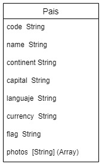

# Api County
Esta API permite realizar operaciones CRUD utilizando MongoDB para gestionar información relacionada con países.

## Inicializar el Api
Si estás inicializando la aplicación por primera vez, debes instalar las dependencias con el siguiente comando:

````
npm -i
`````

Una vez instaladas las dependencias, puedes ejecutar la aplicación con los siguientes comandos:

````
npm run start
`````

O, si prefieres utilizar Nodemon:

````
npm run dev
`````

### Dependencias utilizadas
- **express:** Utilizado para crear el servidor.
- **mongoose:** Se emplea para establecer la conexión con MongoDB.
- **cors:** Facilita las solicitudes entre navegadores.
- **morgan:** Muestra detalladamente los mensajes HTTP.

## Funcionamiento
### Guardar Países
La operación de guardar se realiza a través de la función **saveCountry**, ejecutada mediante una petición **POST** en el siguiente endpoint:

````
/country
`````

### Ver Países
La operación de consultar se realiza mediante la función **viewCountry**, ejecutada con una petición **GET** en el siguiente endpoint:

````
/country
`````

### Editar país
La operación de editar se realiza a través de la función **editCountry**, ejecutada mediante una petición **PUT** en el siguiente endpoint:

````
/country/id
`````

Donde **id** es el identificador del país en la base de datos.

### Eliminar país
La operación de eliminar se realiza con la función **deleteCountry**, ejecutada mediante una petición **DELETE** en el siguiente endpoint:

````
/country/id
`````

# Base de datos
La base de datos utiliza MongoDB como motor, y la estructura de los campos es la siguiente:



- code: Código del país (por ejemplo, CO para Colombia, PE para Perú).

- name: Nombre del país.

- continent: Continente donde se encuentra ubicado el país.

- capital: Capital del país

- currency: Moneda del país

- flag: Bandera del país (debe ser la ubicación del archivo de la imagen).

- photos: Fotografías del país (un arreglo de cadenas que almacena la ruta de cada imagen; se accede a una imagen mediante su posición).

## Ejemplo de Body
En caso de ejecutarse en clientes como Postman, este sería un cuerpo de ejemplo:

````
{
  "code":"CO",
  "name": "Colombia",
  "continent": "Sudamerica",
  "capital":"Bogotá",
  "language": "Español",
  "currency": "COP",
  "flag": "images/flags/co.svg",
  "photos":[
    "images/photos/co/cartagena.jpg",
    "images/photos/co/medellin.jpg"
    ]
}
`````